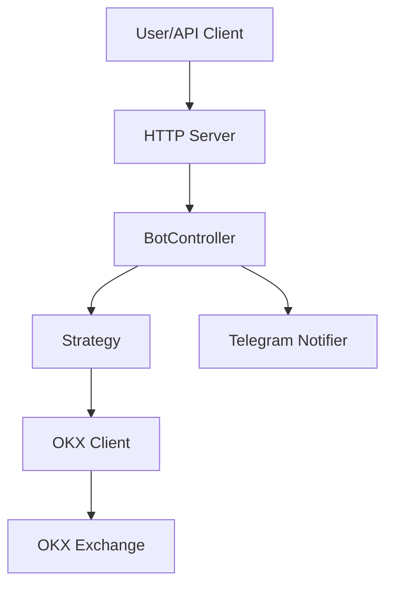
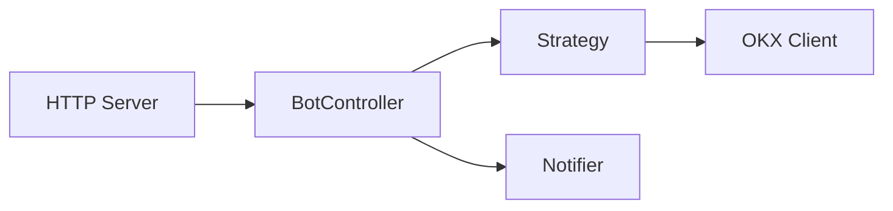

# Grid Trading Bot - 技術設計文件

## 文件資訊

- **專案名稱**: Grid Trading Bot
- **版本**: 0.1.0
- **建立日期**: 2025-11-22
- **狀態**: 開發中

## 目錄

1. [系統概覽](#系統概覽)
2. [架構設計](#架構設計)
3. [模組設計](#模組設計)
4. [資料模型](#資料模型)

---

## 系統概覽

### 專案目標

建立一個極簡的 Go 自動化網格交易系統，專門針對 OKX ETHUSDT 永續合約市場。系統採用直接依賴架構，遵循 YAGNI 原則，不引入不必要的抽象層。

### 核心功能

1. **自動化網格交易**：根據市價自動計算等寬網格，在每個網格線上對稱掛買賣單
2. **即時事件處理**：透過 Websocket 接收市場數據與訂單成交通知
3. **嚴格風控**：內建止損機制與曝險控制，保護資本安全
4. **遠端控制**：HTTP API 介面支援啟動、停止、狀態查詢
5. **即時通知**：Telegram 推送訂單成交與風控事件

### 技術棧

| 組件 | 技術選型 | 版本 | 用途 |
|------|---------|------|------|
| 語言 | Go | 1.23+ | 主要開發語言 |
| HTTP 框架 | Gin | v1.11.0 | REST API Server |
| WebSocket | gorilla/websocket | v1.5.3 | OKX WebSocket 客戶端 |
| 配置解析 | go-yaml | v1.18.0 | YAML 配置檔讀取 |
| 日誌 | zap | v1.27.1 | 結構化日誌 |
| 通知 | telegram-bot-api | v5.5.1 | Telegram 訊息推送 |

---

## 架構設計

### 系統架構圖



### 模組依賴關係



**依賴規則**：
- `HTTP Server` 調用 `BotController`
- `BotController` 協調 `Strategy` 和 `Notifier`
- `Strategy` 直接調用 `OKX Client`
- 所有模組共用 `config` 和 `logger`（圖中省略）

---

## 模組設計

### 1. Config Module (internal/config/)

#### 職責
負責基礎設施配置的讀取、解析與驗證。

#### 檔案結構
```
internal/config/
├── config.go    # 配置結構定義
└── loader.go    # YAML 讀取與驗證
```

#### 核心結構
```go
type Config struct {
    OKX      OKXConfig      // OKX API 認證
    Telegram TelegramConfig // Telegram 通知設定
    Server   ServerConfig   // HTTP Server 設定
}
```

#### 驗證規則
- OKX 認證資訊必填
- Server port 範圍：1024-65535
- API Token 必填

---

### 2. Logger Module (internal/logger/)

#### 職責
提供結構化日誌功能，支援開發與生產環境。

#### 核心功能
```go
func New(development bool) (*zap.Logger, error)
func NewNop() *zap.Logger  // For testing
```

#### 日誌格式
- **Development**: Console 輸出，彩色日誌等級
- **Production**: JSON 格式，適合日誌收集系統

#### 日誌分類
| 類別 | 等級 | 用途 |
|------|------|------|
| 訂單事件 | Info | 掛單、成交、撤單 |
| 風控事件 | Warn/Error | 止損觸發、曝險平倉 |
| WebSocket | Info/Warn | 連線、斷線、重連 |
| HTTP 請求 | Info | API 請求日誌 |
| 系統錯誤 | Error | 異常與錯誤處理 |

---

### 3. OKX Client Module (internal/okx/)

#### 職責
與 OKX 交易所互動，提供 REST API 與 WebSocket 介面。

#### 檔案結構
```
internal/okx/
├── client.go      # Client 主結構
├── rest.go        # REST API 方法
├── websocket.go   # WebSocket 客戶端
├── auth.go        # API 簽名認證
└── models.go      # 資料結構
```

#### OKX REST API 端點

本模組調用的 OKX 交易所 API：
- 帳戶查詢：`/api/v5/account/balance`、`/api/v5/account/positions`
- 訂單操作：`/api/v5/trade/order`（下單）、`/api/v5/trade/cancel-order`（撤單）
- 市場數據：`/api/v5/market/ticker`（查詢即時價格）

#### WebSocket 頻道

| 頻道類型 | 頻道名稱 | 用途 | 認證 |
|---------|---------|------|------|
| 公開 | tickers | ETHUSDT 即時市價 | 否 |
| 私有 | orders | 訂單狀態變化推送 | 是 |

#### API 簽名機制
```go
// HMAC-SHA256 簽名
signature = Base64(HMAC-SHA256(SecretKey, timestamp + method + path + body))

// Headers
OK-ACCESS-KEY: apiKey
OK-ACCESS-SIGN: signature
OK-ACCESS-TIMESTAMP: timestamp (ISO8601)
OK-ACCESS-PASSPHRASE: passphrase
```

#### 連線管理

**WebSocket 重連機制**：
1. 心跳：每 20 秒發送 ping
2. 超時：60 秒未收到訊息視為斷線
3. 重連：指數退避（1s → 2s → 4s），最多 3 次
4. 失敗處理：第 3 次失敗後停止並通知

**錯誤重試**：
- REST API 錯誤：僅網路錯誤或 5xx 錯誤重試 1 次
- 其他錯誤：記錄日誌，不重試

---

### 4. Strategy Module (internal/strategy/)

#### 職責
實作網格交易策略邏輯，包括網格計算、訂單決策、風控機制。

#### 檔案結構
```
internal/strategy/
├── strategy.go  # 主邏輯與狀態管理
├── grid.go      # 網格計算
├── risk.go      # 風控檢查
├── params.go    # 參數結構定義
└── errors.go    # 錯誤定義
```

#### 參數結構

```go
// GridParams - 網格交易參數（由 API 傳入）
type GridParams struct {
    UpperRatio float64  // 上界比例（如 1.05 = 市價上方 5%）
    LowerRatio float64  // 下界比例（如 0.95 = 市價下方 5%）
    GridCount  int      // 網格格數
    OrderSize  float64  // 單格訂單量（ETH）
}

// RiskParams - 風控參數（由 API 傳入）
type RiskParams struct {
    StopLossRatio  float64  // 止損比例（如 0.8 = 80%）
    InitialBalance float64  // 入場總值（USDT）
}
```

#### 網格計算算法

```go
// 等寬網格計算
upper = currentPrice × upperRatio  // e.g., 3000 × 1.05 = 3150
lower = currentPrice × lowerRatio  // e.g., 3000 × 0.95 = 2850
step = (upper - lower) / gridCount // e.g., (3150 - 2850) / 10 = 30

// 生成網格線
gridLines = [lower, lower+step, lower+2*step, ..., upper]
// 結果：[2850, 2880, 2910, ..., 3150]
```

#### 訂單決策邏輯

**初始化**：
1. 在每條網格線上對稱掛買賣單
2. 訂單類型：限價單（Limit Order）
3. 所有訂單等量：`orderSize`

**訂單成交處理**：
```
成交買單（價格 P）
  → 找到對稱網格線（P 上方最近的網格線）
  → 掛賣單（價格 = 對稱線，數量 = orderSize）

成交賣單（價格 P）
  → 找到對稱網格線（P 下方最近的網格線）
  → 掛買單（價格 = 對稱線，數量 = orderSize）
```

#### 網格調整邏輯

**觸發條件**：市價突破網格範圍（< 下界 或 > 上界）

**執行步驟**：
1. 取消所有掛單（CancelAllOrders）
2. 市價平倉所有持倉（ClosePositionMarket）
3. 等待平倉完成
4. 根據新市價重新計算網格
5. 重新掛單

**限制**：無次數限制，價格突破就調整

#### 風控機制

##### 止損檢查
```go
currentEquity = balance + unrealizedPnL
threshold = initialBalance × stopLossRatio  // e.g., 10000 × 0.8 = 8000

if currentEquity < threshold:
    1. 取消所有掛單
    2. 市價平倉
    3. 停止策略運行
    4. 發送 Telegram 通知
```

##### 曝險控制
```go
if abs(position) > 0.001:  // 有持倉
    1. 立即市價平倉
    2. 發送 Telegram 通知
```

**執行時機**：
- 訂單成交後
- 市價更新時
- 定期檢查（每 30 秒）

---

### 5. BotController Module (internal/controller/)

#### 職責
管理機器人生命週期，協調各模組之間的互動，處理事件路由與錯誤。

#### 狀態機

```
          Start()
Idle ─────────────→ Running
  ▲                    │
  │                    │ Error/Stop()
  │                    ▼
  └───────────── Stopped/Error
```

**狀態定義**：
- `Idle`: 初始狀態，未啟動
- `Running`: 運行中，處理訂單與事件
- `Stopped`: 已停止，正常關閉
- `Error`: 錯誤狀態，異常停止

#### 啟動流程

```go
func (bc *BotController) Start(gridParams, riskParams) error {
    // 1. 驗證配置
    // 2. 初始化 OKX Client
    // 3. 連接 WebSocket
    // 4. 設置事件回調：
    //    - OnPriceUpdate → handlePriceUpdate
    //    - OnOrderFilled → handleOrderFilled
    //    - OnDisconnected → handleDisconnected
    // 5. 清理殘留訂單
    // 6. 初始化 Strategy（傳入 gridParams, riskParams）
    // 7. 更新狀態為 Running
    // 8. 發送啟動通知
}
```

#### 停止流程

```go
func (bc *BotController) Stop() error {
    // 1. 取消所有掛單
    // 2. 市價平倉所有持倉
    // 3. 斷開 WebSocket
    // 4. 更新狀態為 Stopped
    // 5. 發送停止通知
}
```

#### 事件路由

```go
// 市價更新
handlePriceUpdate(price) → Strategy.OnPriceUpdate(price)

// 訂單成交
handleOrderFilled(order) → {
    Strategy.OnOrderFilled(order)
    Notifier.SendOrderNotification(order)
}

// 斷線處理
handleDisconnected(err) → {
    Logger.Warn("disconnected")
    // WebSocket 自動重連
}
```

---

### 6. Notifier Module (internal/notifier/)

#### 職責
透過 Telegram Bot API 發送訂單與風控通知。

#### 通知類型

| 通知類型 | 內容 | 觸發時機 |
|---------|------|---------|
| 訂單成交 | 方向、價格、數量、時間、訂單ID | 訂單成交時 |
| 止損觸發 | 當前淨值、止損門檻、時間 | 淨值 < 80% |
| 曝險檢測 | 持倉數量、方向、時間 | 檢測到持倉 |
| 機器人啟動 | 網格範圍、時間 | 啟動成功 |
| 機器人停止 | 時間 | 停止成功 |
| 系統錯誤 | 錯誤訊息、時間 | 發生錯誤 |

#### 訊息格式
- 使用 Markdown 格式
- 包含時間戳記
- 關鍵數據使用 code block 標記

#### 錯誤處理
- 發送失敗時記錄日誌
- **不阻斷主流程**：通知失敗不影響交易執行

---

### 7. HTTP Server Module (ui/)

#### 職責
提供 REST API 介面，支援遠端控制與狀態查詢。

#### 檔案結構
```
ui/
├── server.go      # Server 初始化與路由設定
├── handlers.go    # API handlers
└── middleware.go  # 認證與日誌中介軟體
```

#### API 端點

提供 HTTP 介面：
- `POST /bot/start` - 啟動機器人
- `POST /bot/stop` - 停止機器人
- `GET /bot/status` - 查詢狀態
- `GET /ping` - 健康檢查

---

## 資料模型

### 核心資料結構

#### Order (訂單)
```go
type Order struct {
    OrderID    string    // OKX 訂單 ID
    Side       string    // "buy" / "sell"
    Price      float64   // 訂單價格
    Size       float64   // 訂單數量
    Status     string    // "pending" / "filled" / "cancelled"
    FilledAt   time.Time // 成交時間
    FilledSize float64   // 已成交數量
}
```

#### AccountState (帳戶狀態)
```go
type AccountState struct {
    Balance       float64  // 可用餘額
    Position      float64  // 持倉數量（正=多倉，負=空倉）
    UnrealizedPnL float64  // 未實現盈虧
    Equity        float64  // 淨值 = 餘額 + 未實現盈虧
}
```

#### MarketData (市場數據)
```go
type MarketData struct {
    LastPrice float64   // 最新成交價
    Timestamp time.Time // 時間戳記
}
```

#### BotStatus (機器人狀態)
```go
type BotStatus struct {
    State        BotState // idle/running/stopped/error
    Uptime       string   // 運行時間
    CurrentPrice float64  // 當前市價
    GridRange    string   // 網格範圍（如 "2850.00 - 3150.00"）
    ActiveOrders int      // 掛單數量
    Position     float64  // 當前持倉
    Equity       float64  // 帳戶淨值
    TotalFilled  int      // 累計成交筆數
}
```

---

## 配置管理

### 配置檔案層級

```
configs/
├── config.example.yaml   # 範例配置（版控）
└── config.yaml           # 實際配置（不納入版控）
```

### 配置內容

```yaml
# 基礎設施配置（存於 config.yaml）
okx:
  apiKey: "..."
  secretKey: "..."
  passphrase: "..."
  testNet: true

telegram:
  enabled: true
  token: "..."
  chatID: 123456789

server:
  port: 8080
  apiToken: "..."
```

```json
// 策略參數（透過 API 傳遞）
{
  "gridParams": {
    "upperRatio": 1.05,
    "lowerRatio": 0.95,
    "gridCount": 10,
    "orderSize": 0.01
  },
  "riskParams": {
    "stopLossRatio": 0.8,
    "initialBalance": 1000
  }
}
```

---

## 錯誤處理策略

### 錯誤分類

| 錯誤類型 | 處理策略 | 範例 |
|---------|---------|------|
| 配置錯誤 | 啟動失敗，Fatal | API 金鑰缺失 |
| 網路錯誤 | 重試 1 次 | HTTP timeout |
| API 錯誤 | 記錄日誌，不重試 | 餘額不足 |
| WebSocket 斷線 | 自動重連（最多 3 次） | 連線中斷 |
| 風控觸發 | 緊急平倉，停止運行 | 止損觸發 |

### 錯誤通知

- **Critical**：Telegram 通知 + Error 日誌
- **Warning**：Warn 日誌
- **Info**：Info 日誌

---

## 監控與可觀測性

### 日誌結構

```json
{
  "level": "info",
  "ts": "2025-11-22T09:15:00.123Z",
  "caller": "strategy/grid.go:45",
  "msg": "Order filled",
  "orderID": "123456",
  "side": "buy",
  "price": 3000.50,
  "size": 0.01
}
```

### 關鍵指標

| 指標 | 記錄方式 |
|------|---------|
| 訂單成交數 | Counter in Strategy |
| 網格調整次數 | Counter in Strategy |
| 風控觸發次數 | Logger + Telegram |
| WebSocket 重連次數 | Logger |
| API 錯誤次數 | Logger |

### Telegram 通知即時性

所有關鍵事件立即推送：
- 訂單成交（即時）
- 止損觸發（即時）
- 曝險檢測（即時）
- 系統錯誤（即時）

---
## 參考資料

- [OKX API 文檔](https://www.okx.com/docs-v5/)
- [OKX WebSocket API](https://www.okx.com/docs-v5/en/#overview-websocket)
- [Telegram Bot API](https://core.telegram.org/bots/api)
- [PRD 文件](.claude/prds/grid-trading-bot.md)
- [Epic 文件](.claude/epics/grid-trading-bot/epic.md)

---

## 附錄

### A. 網格交易策略說明

**網格交易**是一種中性策略，不預測市場漲跌方向，而是利用價格震盪獲利：

1. **網格設置**：在一定價格範圍內均勻分佈買賣訂單
2. **自動執行**：價格下跌觸發買單，價格上漲觸發賣單
3. **持續獲利**：每次成交後掛反向訂單，賺取價差

**適用市場**：橫盤震盪、波動率中等的市場

**風險**：趨勢市場（單邊上漲或下跌）會導致虧損

### B. 詞彙表

| 術語 | 英文 | 說明 |
|------|------|------|
| 網格 | Grid | 在一定價格範圍內均勻分佈的買賣價位 |
| 等寬網格 | Equal-width Grid | 每個價格格子的寬度相同 |
| 中性策略 | Neutral Strategy | 不預測漲跌方向，利用震盪獲利 |
| 曝險 | Exposure | 持有單向未對沖倉位的風險狀態 |
| 止損 | Stop Loss | 預設的最大虧損退出點 |
| 市價平倉 | Market Close | 以當前市場價格立即平倉 |
| 永續合約 | Perpetual Swap | 無到期日的期貨合約 |

---

